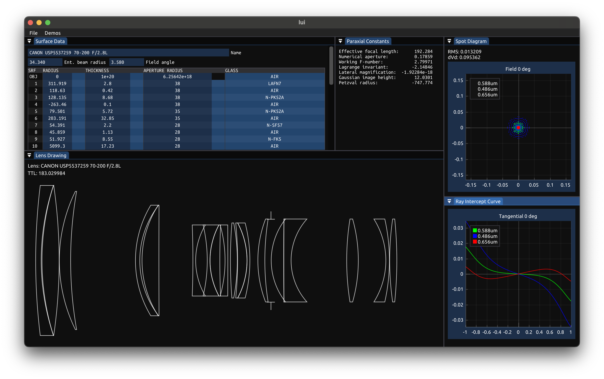

# lui


A very tiny UI for my very tiny lens library [lore](https://github.com/iRath96/lore).

## Build instructions

```bash
# Make sure to clone submodules
git clone --recursive git@github.com:iRath96/lui.git
# If you forgot the --recursive option, you can run:
# git submodule update --init --recursive

# Build using cmake
cmake . -B build
cmake --build build --config Release -j

# Run in build folder (so that data/ files are found)
cd build
./lui
```
